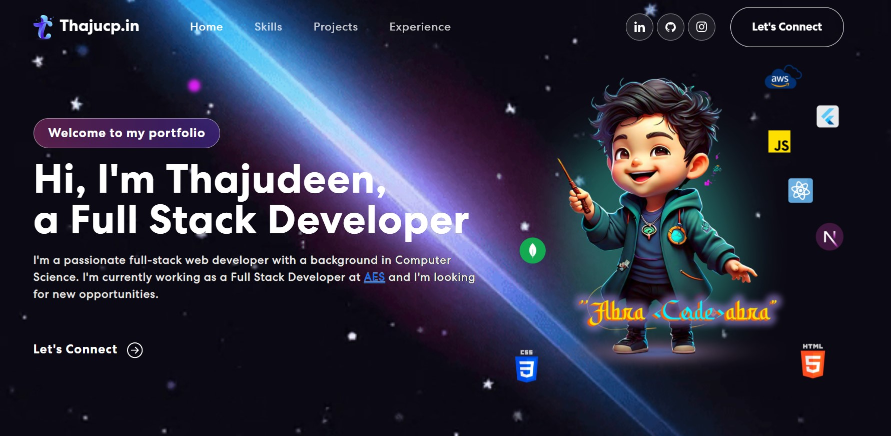

<a id="readme-top"></a>

[![MIT License][license-shield]][license-url]
[![LinkedIn][linkedin-shield]][linkedin-url]


<!-- PROJECT LOGO -->
<br />
<div align="center">
  

  <h3 align="center" style="font-size: 42px;">Thajucp.in - Personal Portfolio</h3>

  <p align="center">
    My personal portfolio website created using React, React-bootstrap and Framer Motion.
    <br />
    <a href="https://thajucp.in/"><strong>Live Demo »</strong></a>
    <br />
    <br />
    <a href="https://github.com/othneildrew/Best-README-Template">Description</a>
    ·
    <a href="https://github.com/othneildrew/Best-README-Template/issues/new?labels=bug&template=bug-report---.md">Replicate</a>
    ·
    <a href="https://github.com/othneildrew/Best-README-Template/issues/new?labels=enhancement&template=feature-request---.md">Request Feature</a>
  </p>
</div>


<!-- ABOUT THE PROJECT -->
## About The Project



There are many great README templates available on GitHub; however, I didn't find one that really suited my needs so I created this enhanced one. I want to create a README template so amazing that it'll be the last one you ever need -- I think this is it.

Here's why:
* Your time should be focused on creating something amazing. A project that solves a problem and helps others
* You shouldn't be doing the same tasks over and over like creating a README from scratch
* You should implement DRY principles to the rest of your life :smile:

Of course, no one template will serve all projects since your needs may be different. So I'll be adding more in the near future. You may also suggest changes by forking this repo and creating a pull request or opening an issue. Thanks to all the people have contributed to expanding this template!

Use the `BLANK_README.md` to get started.

<p align="right">(<a href="#readme-top">back to top</a>)</p>


## Built With

This project was build using the following Tools and Technologies.

<div style="display: flex; flex-direction: row; width: 50%; padding:10px; padding-bottom:0;">
<div style="flex: 1;">

* [![React][React.js]][React-url]

* [![Bootstrap][Bootstrap.com]][Bootstrap-url]

* [![VScode][VSCode-shield]][VScode-url]

</div>
<div style="flex: 1;">

* [![Vercel][Vercel-shield]][Vercel-url]

* [![Figme][Figma-shield]][Figma-url]

</div>
</div>

<p align="right">(<a href="#readme-top">back to top</a>)</p>


<!-- GETTING STARTED -->
## Getting Started

This is an example of how you may give instructions on setting up your project locally.
To get a local copy up and running follow these simple example steps.

### Prerequisites

This is an example of how to list things you need to use the software and how to install them.
* npm
  ```sh
  npm install npm@latest -g
  ```

### Installation

_Below is an example of how you can instruct your audience on installing and setting up your app. This template doesn't rely on any external dependencies or services._

1. Get a free API Key at [https://example.com](https://example.com)
2. Clone the repo
   ```sh
   git clone https://github.com/your_username_/Project-Name.git
   ```
3. Install NPM packages
   ```sh
   npm install
   ```
4. Enter your API in `config.js`
   ```js
   const API_KEY = 'ENTER YOUR API';
   ```

<p align="right">(<a href="#readme-top">back to top</a>)</p>


<!-- USAGE EXAMPLES -->
## Usage

Use this space to show useful examples of how a project can be used. Additional screenshots, code examples and demos work well in this space. You may also link to more resources.

_For more examples, please refer to the [Documentation](https://example.com)_

<p align="right">(<a href="#readme-top">back to top</a>)</p>


<!-- ROADMAP -->
## Roadmap

- [x] Add Changelog
- [x] Add back to top links
- [ ] Add Additional Templates w/ Examples
- [ ] Add "components" document to easily copy & paste sections of the readme
- [ ] Multi-language Support
    - [ ] Chinese
    - [ ] Spanish

See the [open issues](https://github.com/othneildrew/Best-README-Template/issues) for a full list of proposed features (and known issues).

<p align="right">(<a href="#readme-top">back to top</a>)</p>


<!-- CONTRIBUTING -->
## Contributing

Contributions are what make the open source community such an amazing place to learn, inspire, and create. Any contributions you make are **greatly appreciated**.

If you have a suggestion that would make this better, please fork the repo and create a pull request. You can also simply open an issue with the tag "enhancement".
Don't forget to give the project a star! Thanks again!

1. Fork the Project
2. Create your Feature Branch (`git checkout -b feature/AmazingFeature`)
3. Commit your Changes (`git commit -m 'Add some AmazingFeature'`)
4. Push to the Branch (`git push origin feature/AmazingFeature`)
5. Open a Pull Request

<p align="right">(<a href="#readme-top">back to top</a>)</p>


<!-- LICENSE -->
## License

Distributed under the MIT License. Feel free to clone and use this project for your own portfolio.

<p align="right">(<a href="#readme-top">back to top</a>)</p>


<!-- CONTACT -->
## Contact Me

Thajudeen CP - [info@thajucp.in](mailto:info@thajucp.in)

Github Profile: [https://github.com/thajucp123](https://github.com/thajucp123)

LinkedIn: [https://linkedin.com/in/thaju-fakrudheen/](https://linkedin.com/in/thaju-fakrudheen/)

<p align="right">(<a href="#readme-top">back to top</a>)</p>


<!-- ACKNOWLEDGMENTS -->
## Acknowledgments

This is a list of useful resources and libraries I've used in my project. I've included a few of my favorites to kick things off!

* [React Bootstrap](https://react-bootstrap.netlify.app/)
* [Framer Motion](https://www.framer.com/motion/) - Animation library
* [Bootsrap Icons](https://icons.getbootstrap.com/)
* [React Parallax Tilt](https://github.com/mkosir/react-parallax-tilt/)
* [Dev Icons](https://devicon.dev/) - set of icons representing programming languages, designing, and development tools
* [Img Shields](https://shields.io)
* [Font Awesome](https://fontawesome.com)
* [Codepen](https://codepen.io/)


<p align="right">(<a href="#readme-top">back to top</a>)</p>


<!-- MARKDOWN LINKS & IMAGES -->
<!-- https://www.markdownguide.org/basic-syntax/#reference-style-links -->

[license-shield]: https://img.shields.io/github/license/othneildrew/Best-README-Template.svg?style=for-the-badge
[license-url]: https://github.com/othneildrew/Best-README-Template/blob/master/LICENSE.txt
[linkedin-shield]: https://img.shields.io/badge/-LinkedIn-black.svg?style=for-the-badge&logo=linkedin&colorB=555
[linkedin-url]: https://linkedin.com/in/thaju-fakrudheen
[product-screenshot]: images/screenshot.png

[React.js]: https://img.shields.io/badge/React-20232A?style=for-the-badge&logo=react&logoColor=61DAFB
[React-url]: https://reactjs.org/

[Bootstrap.com]: https://img.shields.io/badge/Bootstrap-563D7C?style=for-the-badge&logo=bootstrap&logoColor=white
[Bootstrap-url]: https://getbootstrap.com

[VSCode-shield]: https://img.shields.io/badge/VSCode-007ACC?style=for-the-badge&logo=visual-studio-code&logoColor=white
[VSCode-url]: https://code.visualstudio.com/

[Vercel-shield]: https://img.shields.io/badge/Vercel-000000?style=for-the-badge&logo=vercel&logoColor=white
[Vercel-url]: https://vercel.com/

[Figma-shield]: https://img.shields.io/badge/Figma-F24E1E?style=for-the-badge&logo=figma&logoColor=white
[Figma-url]: https://www.figma.com/
